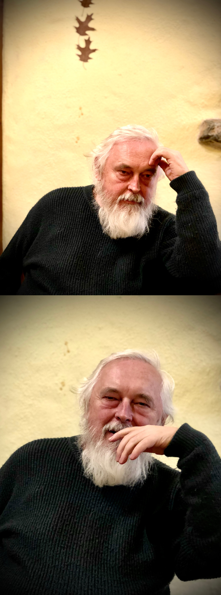

# Aleš Čepek

- cepek@gnu.org
- <a href="https://www.gnu.org/software/gama/">Gama</a>
- <a href="http://sqltutor.fsv.cvut.cz">SQLtutor</a>

- <a href="https://www.minorplanetcenter.net/db_search/show_object?object_id=32596">(32596) Čepek = 2001 QS154</a>

- <a href="https://github.com/cepek?tab=repositories">repositories</a>

<pre>
  ,' ,-_-. '.
 ((_/)o o(\_))
  `-'(. .)`-'
      \_/
</pre>

<pre>
-----BEGIN PGP PUBLIC KEY BLOCK-----

mQGiBD9M9qURBADde9357ppjjcVbdANy8oopZD2dCbH52msNR+K5MMaU3J/7PW7G
o5PlZsTn8oQr87k7acfkZZMY1Zr1a4SdqN+ZibX4BiiHacAELyxSIg70vFkQt9lG
MvDXaYtVWUQNKFf3pzh6dLAF+sWIG5oMJ38T8nmw0JymU7YHVLsRHi3tzwCgxMPA
unZ2D1r7jr6B65JTH7talD0D/1yzYa85BlnVrnPBXShhLQCrGzyFOwX7caEWm79O
Hhwmf48c33TEpuqheKiIkY75vIN1y0ogZW44a3GmkzNzQeOPMmPbgdlyErc0Nazb
fLvgmBOjRNm8okrWVbiIUNHED2HPY2Vaxm7sh94pONbbBn93ojTtdW/1N06vtnuS
YSyGA/9l6BlfM18AK9lNQm5HwexlETnCO33wrHyORXYLBAQe3r4w3/q5Ounx6aKQ
f9amOjz90cc2fm2MvVJ4GMbK1yFRhTn1vB35i52u1L15s2Zw3kwRsUekWgr6tfpA
w53a81fdMRdMFupesOvjd/GWT8C5z3Xcq9wqcZ86g7j78WPda7QaQWxlcyBDZXBl
ayA8Y2VwZWtAZ251Lm9yZz6IXgQTEQIAHgUCQsZpZwIbIwYLCQgHAwIDFQIDAxYC
AQIeAQIXgAAKCRCvLWpBLF9uuEFHAJ4kOLwhg1RUH1uE8RlR2rj7HF88EACeK/yP
2c416BEQFzomXq256xe6ioK0HkFsZXMgQ2VwZWsgPGNlcGVrQGZzdi5jdnV0LmN6
PohfBBMRAgAXBQI/TPalBQsHCgMEAxUDAgMWAgECF4AAEgkQry1qQSxfbrgHZUdQ
RwABAdczAJ0ftnJKxt/8UMIaEXCJkrWwfqvq3ACgrZ/CF8wH55uLS6ht3IVOvZPk
1cG5AQ0EP0z2pxAEALrlu76v9pY0kn0E+dqroewEUCUlyHK66QvgJ7/CNzc77nyv
f884J2j1AQXk3J4yuva/MQt651AG9J3XdynCtm3H/zwi9K9jSDaFpVMroou5hh61
2AxSzVoQpVuETtpnHKSW9uVdkg8bgQMndE9SBzUMdzPBOE5O9tCxx0cLx/GvAAQL
BACnK2eaWhpZO+c0mildhuRqd+JOn84VeO2xBGIP3azR0bffWYsSXXHBGYsROeGL
ZIIT5LypZf5JxV693qxaIGZPD8NuWY+hZuRy07ImP3l+F9ewPfzDIzY/WXFUEX1q
XtgYymQW8ANWU3xsl/LPlCO/tVQis+kCtGFj0afGiMEA8IhGBBgRAgAGBQI/TPan
AAoJEK8takEsX264kNQAoKEU5jiyp8zlGCsISFlfJEazoX5lAJ0eUpzsV7u5kn9F
wI+xJw4CI8NkZQ==
=BPjL
-----END PGP PUBLIC KEY BLOCK-----
</pre>

